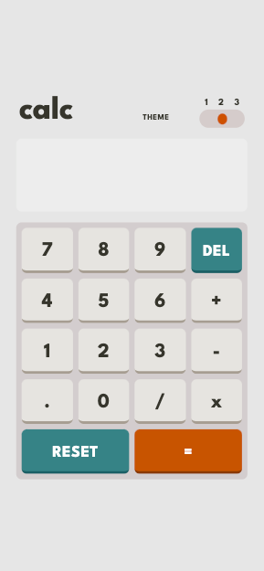
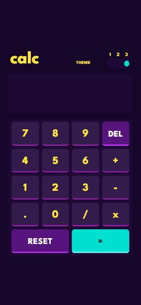
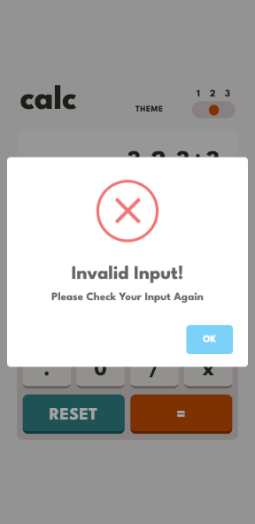
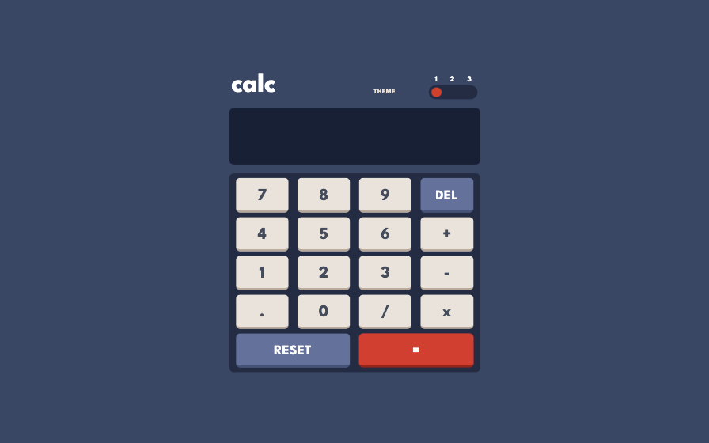
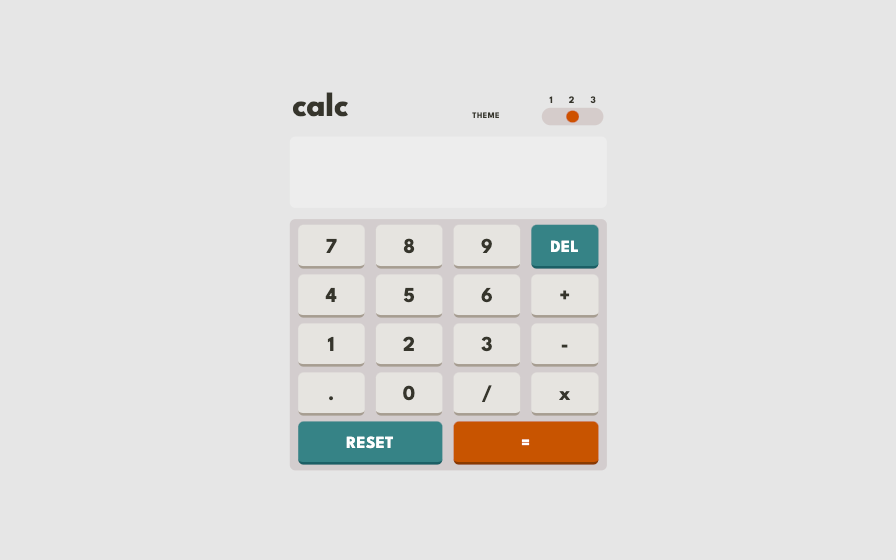

# Calculator- App V1.0

 

-> **[Live URL - Click Here](https://calc-mustak.netlify.app)**  

**This is `A Smart Calculator` App With countless <i>Hidden Features</i> for making a simple calculator `Interesting` and `Smart`**  

## Features that make it comparatively more handy and efficacious

- **BODMASS** - Follows **_Bracket, Order, Division, Multiplication, Addition, and Subtraction_** (**BODMAS**) Math rule
- **Simplistic Responsive Design** - Only those features are there which a user would mostly need
- **Tight Security** - The best possible alternative of **_notorious_** `eval()` is used here
- **OS Theme Preference** - User's OS Theme preference is respected at user's initial visit
- **Collection of Themes** - On the popular Demand, three different types of themes and modes are made available
- **Storage Reserve** - User's Preferred Theme, Calculations and Inputs will remain **_unlost_** even after reload or restart
- **Quick Reset** - Clicking Twice on any toggle button will instantly reset all the stored data
- **No Double Trouble** - Back to Back similar problem causing inputs [`.,+,-,x,/`] will be filtered
- **Smart Mathematical Operator Detection** - Smartly Detects if mathematical operator like `*` is missing and needed infront of `(`
- **Device Keyboard Toggle** - **Double Tapping** on the calculator screen would **`Enable/Disable`** the built in direct device keyboard (**`Default: Disabled` Recommended**)
- **Flexible Edit** - Any number and at any position delete or number modification can be done by using direct **device keyboard**
- **Error Handling** - Any Detected Error will be caught and displayed in `Console` and Invalid Input error will be displayed using **_Sweet Alert_**
   

### Built with

- [HTML5](https://html.com/)
- [TailwindCSS](https://tailwindcss.com/)
- [JavaScript ES6](http://es6-features.org/)
- [Sweet Alert](https://sweetalert.js.org/)
- [Frontend Mentor-Design](https://www.frontendmentor.io/challenges/calculator-app-9lteq5N29)

### Screenshot

 

 
 

**Developed By `Mohammad Mustak Absar Khan`**

